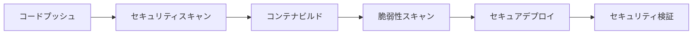

# セキュリティガイド

## 概要

この旅行アプリケーションは、Google Cloud Platform 上でセキュリティベストプラクティスに従って構築されています。このドキュメントでは、実装されているセキュリティ機能と設定について説明します。

## 🔒 実装済みセキュリティ機能

### 1. ネットワークセキュリティ

#### VPC (Virtual Private Cloud)
- **プライベートネットワーク**: 専用VPC `travel-app-vpc-{environment}` でサービスを分離
- **プライベートサブネット**: 内部通信専用サブネット `10.0.0.0/24`
- **Cloud NAT**: プライベートリソースからのアウトバウンドアクセス制御
- **VPC Access Connector**: Cloud Run とVPC間のセキュアな接続

#### ファイアウォールルール
```
travel-app-allow-internal: VPC内部通信許可 (ポート: 80, 443, 8080, 3000)
travel-app-allow-health-check: Google ヘルスチェック許可
travel-app-deny-all: その他すべての通信を拒否 (優先度: 1000)
```

### 2. 認証・認可

#### サービス間認証
- **専用サービスアカウント**: 各サービスに最小権限の専用アカウント
- **Cloud Run 認証**: サービス間通信でIAM認証を使用
- **Workload Identity**: GitHub Actions からの安全なデプロイ

#### 権限設定
```bash
# メインアプリ
travel-app-{env}@project.iam.gserviceaccount.com
├── roles/datastore.user (Firestore アクセス)
├── roles/secretmanager.secretAccessor (シークレット読み取り)
└── roles/run.invoker (Agent サービス呼び出し)

# AI エージェント
travel-agent-{env}@project.iam.gserviceaccount.com
├── roles/secretmanager.secretAccessor (API キー読み取り)
├── roles/aiplatform.user (Gemini API使用)
└── roles/run.invoker (MCP サービス呼び出し)

# MCP サービス
travel-mcp-{env}@project.iam.gserviceaccount.com
└── 基本実行権限のみ
```

### 3. シークレット管理

#### Secret Manager統合
すべての機密情報をSecret Managerで管理:

```bash
travel-app-jwt-secret-{env}      # JWT署名キー
travel-app-gemini-api-key-{env}  # Gemini APIキー
travel-app-maps-api-key-{env}    # Google Maps APIキー
travel-app-db-connection-{env}   # DB接続文字列
```

#### アクセス制御
- サービスごとに必要最小限のシークレットアクセス権限を付与
- GitHub Actions には管理権限を付与（デプロイ時の更新用）

### 4. セキュリティ監視

#### Cloud Logging & Monitoring
- **セキュリティログ収集**: BigQuery にセキュリティ関連ログを集約
- **アラートポリシー**: 認証失敗、異常リクエスト、エラー率監視
- **ダッシュボード**: リアルタイムセキュリティ状況の可視化

#### 監視項目
- 認証失敗率（10回/5分以上でアラート）
- リクエスト量異常（本番: 1000/分, 開発: 100/分）
- エラー率（5回/10分以上でアラート）
- IAMポリシー変更
- Secret Manager アクセス

### 5. コンテナセキュリティ

#### Docker イメージセキュリティ
- **Trivy スキャン**: CI/CDパイプラインで脆弱性スキャン実行
- **非rootユーザー**: すべてのコンテナをUID 1000で実行
- **リソース制限**: CPU/メモリ制限でリソース枯渇攻撃を防止

#### 実行環境
- **Gen2 実行環境**: 最新のセキュリティ機能を使用
- **最小権限実行**: 不要な権限を排除

## 🛡️ セキュリティベストプラクティス

### 1. デプロイメント

#### セキュアなデプロイフロー


#### 必須チェックポイント
- [ ] Trivy セキュリティスキャン合格
- [ ] VPC コネクタ設定済み
- [ ] 専用サービスアカウント使用
- [ ] Secret Manager からシークレット注入
- [ ] 最小権限IAM設定

### 2. 運用時セキュリティ

#### 定期的な確認項目
- [ ] IAM権限の棚卸し（月次）
- [ ] シークレットローテーション（四半期）
- [ ] セキュリティアップデート適用
- [ ] アクセスログ監査
- [ ] 脆弱性スキャン実行

### 3. インシデント対応

#### セキュリティインシデント発生時
1. **即座の対応**
   ```bash
   # サービス無効化（緊急時）
   gcloud run services update SERVICE_NAME --no-traffic
   
   # 不正なIAM権限削除
   gcloud projects remove-iam-policy-binding PROJECT_ID --member=... --role=...
   ```

2. **調査**
   ```bash
   # セキュリティログ確認
   gcloud logging read 'resource.type="cloud_run_revision" severity>=ERROR'
   
   # IAM変更履歴確認
   gcloud logging read 'protoPayload.methodName="SetIamPolicy"'
   ```

3. **復旧**
   - インシデント原因の修正
   - セキュリティ設定の強化
   - 影響範囲の確認とユーザー通知

## 🔧 セットアップ手順

### 1. インフラストラクチャのデプロイ

```bash
# リポジトリクローン
git clone https://github.com/NAKAHARA-Yuki/ai_agent_hackathon_app.git
cd ai_agent_hackathon_app

# 環境変数設定
export PROJECT_ID="your-gcp-project-id"
export ENVIRONMENT="prod"  # または "dev"
export REGION="asia-northeast1"
export SECURITY_EMAIL="your-security-team@example.com"

# インフラセットアップ実行
./infrastructure/scripts/setup-infrastructure.sh
```

### 2. シークレット設定

```bash
# JWT Secret（ランダム生成推奨）
openssl rand -base64 32 | gcloud secrets create travel-app-jwt-secret-prod --data-file=-

# Gemini API Key
echo "YOUR_GEMINI_API_KEY" | gcloud secrets create travel-app-gemini-api-key-prod --data-file=-

# Google Maps API Key  
echo "YOUR_MAPS_API_KEY" | gcloud secrets create travel-app-maps-api-key-prod --data-file=-
```

### 3. GitHub Actions設定

GitHub リポジトリの Secrets に以下を設定:

```
GCP_PROJECT_ID: Google Cloud プロジェクトID
CLOUD_RUN_REGION: デプロイリージョン
GCP_WORKLOAD_IDENTITY_PROVIDER: Workload Identity プロバイダー
GCP_SERVICE_ACCOUNT_EMAIL: デプロイ用サービスアカウント
```

## 🚨 セキュリティアラート

### 監視ダッシュボード
- **URL**: https://console.cloud.google.com/monitoring/dashboards
- **ダッシュボード名**: Travel App Security Dashboard ({environment})

### アラート通知
設定されたメールアドレスに以下のアラートが送信されます:
- 認証失敗率が閾値を超過
- 異常な高頻度リクエスト検出
- エラー率上昇
- セキュリティ関連ログの重要な変化

## 📋 セキュリティチェックリスト

### デプロイ前
- [ ] 脆弱性スキャン実行・合格
- [ ] IAM設定レビュー
- [ ] Secret Manager設定確認
- [ ] ファイアウォールルール確認

### デプロイ後
- [ ] サービス間通信確認
- [ ] セキュリティダッシュボード確認
- [ ] アラート設定テスト
- [ ] アクセスログ確認

### 定期メンテナンス
- [ ] 四半期セキュリティレビュー
- [ ] シークレットローテーション
- [ ] 権限棚卸し
- [ ] セキュリティアップデート適用

## 🆘 サポート

セキュリティに関する質問や問題報告:
- **Eメール**: security@example.com
- **GitHub Issues**: [セキュリティラベル付きでissue作成](https://github.com/NAKAHARA-Yuki/ai_agent_hackathon_app/issues/new?labels=security)

### 脆弱性報告
セキュリティ脆弱性を発見した場合:
1. **非公開で報告**: security@example.com に連絡
2. **詳細情報提供**: 再現手順、影響範囲、修正提案
3. **責任ある開示**: 修正完了まで公開を控える

---

**注意**: このセキュリティ設定は継続的な改善が必要です。定期的な見直しとアップデートを実施してください。